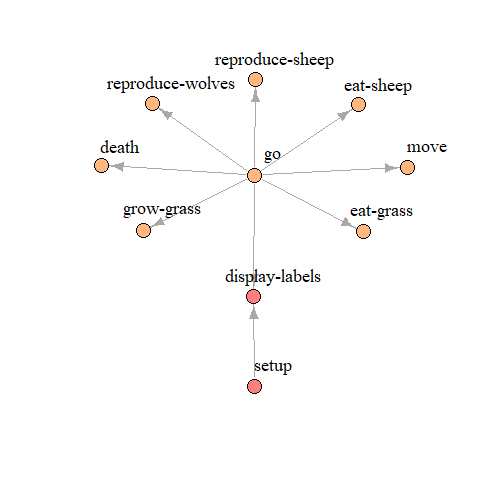

# nldoc

The `nldoc` function within nlrx can be used to create NetLogo documentations using R.
The function searches NetLogo model files for Markdown headers.
The documentation can be created in different formats (html, pdf, docx) and styles.
There are also utility functions, such as creation of a procedure network (`nldoc_network()`).

## Example

#### Model documentation

In order to create NetLogo model documentations with nlrx, documentation tags need to be added to the NetLogo model.
These tags are very similar to roxygen documentation tags and are called noxygen tags for the purpose of this package.
Noxygen tags are organized in three main groups:

* General model information
    * `@model Defines the title for the model documentation
    * `@author Defines author of the model (multiple author tags can be used to define several authors)
* Global definitions
    * `@global Defines the name of a global definitions (e.g. globals, patches-owns, breeds, ...)
    * `@details Further description of the global definition (multi line: each further line needs to start with details tag)
    * `@code TRUE/FALSE if following code should be included in the documentation
* Procedures
    * `@procedure Defines the name of a model procedure
    * `@param Defines a parameter that needs to be provided for the function call
    * `@return Description of the return value (in case of to-report functions)
    * `@details Further description of the model procedure (multi line: each further line needs to start with details tag)
    * `@code TRUE/FALSE if following code should be included in the documentation

For example, the start of a NetLogo model file with noxygen code could look like this:

```{r eval=FALSE}
;`@model Wolf Sheep Predation (NetLogo models library)
;`@author Uri Wilenski

;`@global Subfiles
;`@details We included a subilfe to the wolf sheep model to demonstrate that nls files are supported by nldoc
;`@code TRUE
__includes["Wolf Sheep Predation Extra.nls"]

;`@global Global variables
;`@details There is only one global variable that stores the max number of sheep allowed
;`@code TRUE
globals [ max-sheep ]  ; dont let sheep population grow too large

;`@global Breeds
;`@details There are two breeds: sheep and wolves
;`@code TRUE
breed [ sheep a-sheep ]  ; sheep is its own plural, so we use "a-sheep" as the singular.
breed [ wolves wolf ]

;`@global Agent properties
;`@details Sheep and wolves have a energy variable. Patches have a countdown variable to store the current state of the grass regrowth countdown.
;`@code TRUE
turtles-own [ energy ]       ; both wolves and sheep have energy
patches-own [ countdown ]

;`@procedure Setup
;`@details The setup procedure first resets the model.
;`@details Depending on the chosen model version, grass patches are initialized.
;`@details Finally, wolves and sheep are created.
;`@code FALSE
to setup
  ...
end

```

One, or more model files containing noxygen tags, can be used to call the `nldoc` function of the nlrx package.
The procedure creates a markdown file and renders the documentation in the specified output.
As an example, we added noxygen tags to the Wolf Sheep model from the NetLogo models library.
These modified model files are hosted on github. We use these files to render a documentation in html.
Example output: [nldoc documentation](nlrx_nldocumentation.html)

```{r eval=FALSE}
# Load nlrx:
library(nlrx)
outpath <- tempdir()

# List model files (.nls subfiles are also supported)
modelfiles <- c("https://raw.githubusercontent.com/nldoc/nldoc_pg/master/WSP.nlogo",
                "https://raw.githubusercontent.com/nldoc/nldoc_pg/master/WSP.nls")


## Create documentation:
# Themes: "journal", "cerulean", "flatly", "readable", "spacelab", "united", "cosmo"
# output_format: "pdf "html" "docx"
nldoc(modelfiles = modelfiles,
      infotab=TRUE,
      gui=TRUE,
      bs=TRUE,
      outpath = outpath,
      output_format = "html",
      number_sections = TRUE,
      theme = "cosmo",
      date = date(),
      toc = TRUE)
```

#### Model procedure network

Another useful function of the nlrx package is the creation of model procedure graphs (`nldoc_network()`).
This function can be used for any NetLogo model, even if the code does not contain noxygen tags.

```{r eval=FALSE}
# Load nlrx:
library(nlrx)

# List model files (.nls subfiles are also supported)
modelfiles <- c("https://raw.githubusercontent.com/nldoc/nldoc_pg/master/WSP.nlogo",
                "https://raw.githubusercontent.com/nldoc/nldoc_pg/master/WSP.nls")


## Determine the function network with nldoc:
nw <- nldoc_network(modelfiles)

## Determine communities within the network and plot using Igraph package:
library(igraph)
com <- walktrap.community(nw)
V(nw)$community <- com$membership
rain <- rainbow(14, alpha=.5)
V(nw)$color <- rain[V(nw)$community]

plot(nw,
     edge.arrow.size=1,
     vertex.label.color="black",
     vertex.label.dist=2.5,
     vertex.size=10,
     edge.curved=0,
     vertex.label.cex=1.5,
     layout=layout_with_fr(nw, niter = 2000))

## Interactive plot using igraph::tkplot
tkplot(nw, layout=layout_with_fr(nw, niter = 2000))
```

<center>

</center>
